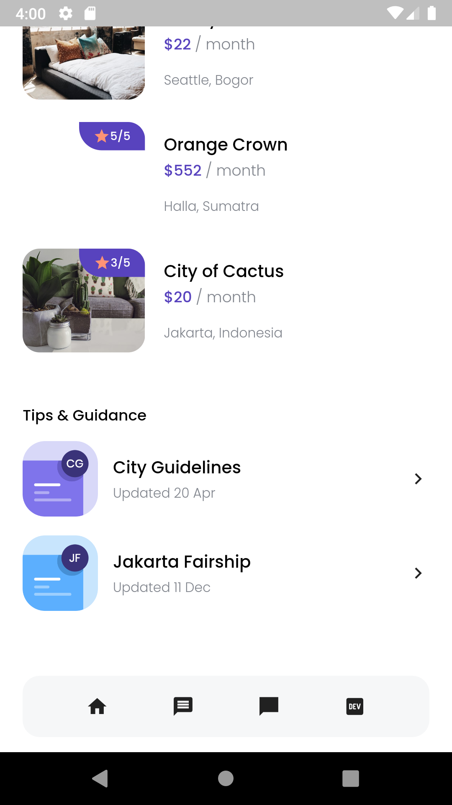

# FLUTTER APP : Cozy App (Find House)

### Description
Create Find House app using Flutter with consume API from [Cozy](https://bwa-cozy.herokuapp.com/recommended-spaces).

### Features
- Consume Api

### Package
- google_fonts
- responsive_framework
- url_launcher
- freezed
- showcase_framework

### Tech Used
 

## Screenshots

  | |

  |  | |
